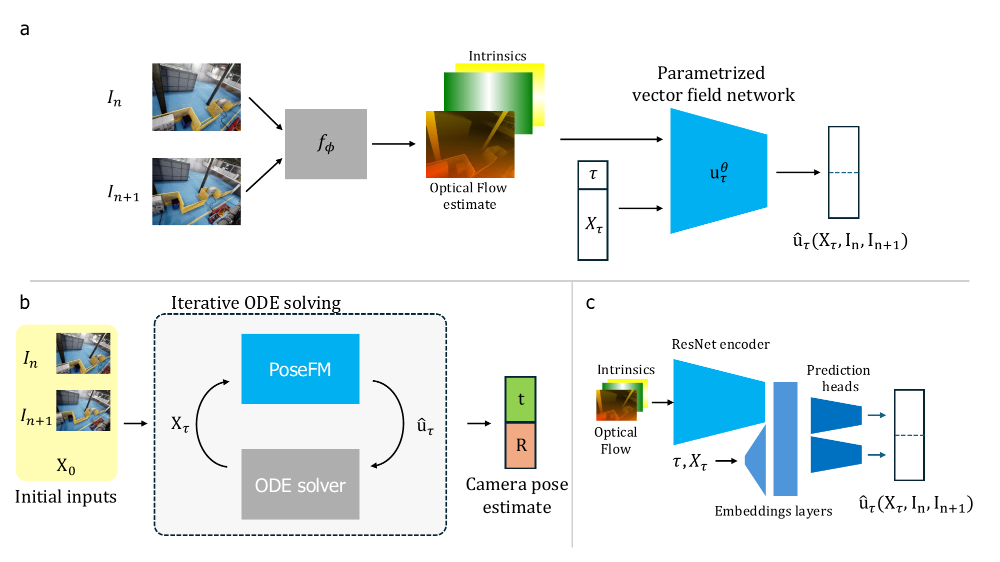

<h1 align="center">
  <b>PoseFM: Relative Camera Pose Estimation Through
Flow Matching</b>
</h1>

<p align="center">
  <a href="https://arxiv.org/abs/2604.22350v1">Paper</a>
</p>

PoseFM is the first visual odometry framework based on generative modeling and Flow Matching. This repository provides the official implementation accompanying the paper.

<p align="center">
  
  <br>
  <em>PoseFM overview. The figure depicts our training setup (a), inference setup (b) and model architecture (c). For more details refer to the paper.</em>
</p>

## Requirements
PoseFM was built with Python 3.11, PyTorch 2.10.0 and CUDA 12. Additionally we rely on [voloader](https://github.com/DominQu/voloader) for VO datasets implementations. For dependency management we use [uv](https://docs.astral.sh/uv/).

## Installation
1. Install [uv](https://docs.astral.sh/uv/) according to its docs.
2. Clone this repository:
    ```bash
    git clone https://github.com/helsinki-sda-group/posefm.git
    ```
3. Navigate to the project directory:
    ```bash
    cd posefm
    ```
You are good to go. You can run python scripts with `uv run`.

## Usage

### Download test data
To test our model please download test data from [TartanAir](https://github.com/castacks/tartanair_tools?tab=readme-ov-file#download-the-testing-data-for-the-cvpr-visual-slam-challenge), [KITTI](https://www.cvlibs.net/datasets/kitti/eval_odometry.php) and [TUM-RGBD](https://cvg.cit.tum.de/data/datasets/rgbd-dataset/download). Add the path to the dataset to a corresonding config. For details on dataset structure check [voloader](https://github.com/DominQu/voloader).

### Download model
Our model weights will be made available soon.

### Prepare config
To run PoseFM you need a config file. We have provided example configs for testing the model on different datasets and for training in the `.\configs` directory. After selecting the appropriate config please modify it with your dataset path and model weights path.

### Run PoseFM
Inference of PoseFM can be performed with:
```bash
uv run posefm.py --config <path-to-config> --out <output-dir>
```
As a result of this command, PoseFM will create a trajectory for the provided test dataset. If the test dataset contained ground truth poses, then the code will additionally save the GT trajectory and calculate metrics.

## Training
To train a model you can use the `train.py` script. You will need a config file to perfrom training. With the config prepared simply run:
```bash
uv run train.py --config <path-to-config>
```
## License

This project is licensed under the [MIT License](LICENSE). Some parts of the code are licensed under BSD License.

## Contact

For questions or feedback, please open an issue.

## Cite
```
@article{kuczkowski2026posefm,
      title={PoseFM: Relative Camera Pose Estimation Through Flow Matching}, 
      author={Dominik Kuczkowski and Laura Ruotsalainen},
      journal={arXiv preprint arXiv:2604.22350}
      year={2026},
}
```
